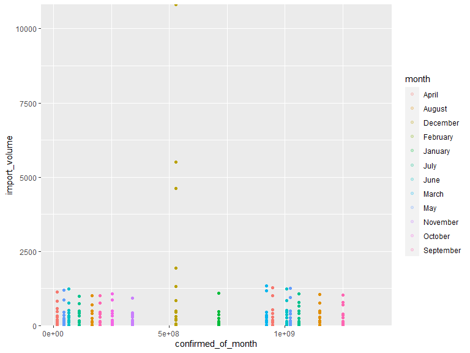

Plot 4
================
Lynn Chen

``` r
## Import data 
covid = 
  read_csv("./data/covid_data_monthly.csv") %>% 
  mutate(month = month.name[as.numeric(month)])
```

    ## Rows: 20 Columns: 6

    ## -- Column specification --------------------------------------------------------
    ## Delimiter: ","
    ## chr (1): month
    ## dbl (5): year, Confirmed_of_Month, Deaths_of_Month, Recovered_of_Month, Acti...

    ## 
    ## i Use `spec()` to retrieve the full column specification for this data.
    ## i Specify the column types or set `show_col_types = FALSE` to quiet this message.

``` r
export_volume_df = read_csv("./data/cleaned data/export_volume_combined.csv")
```

    ## Rows: 855 Columns: 4

    ## -- Column specification --------------------------------------------------------
    ## Delimiter: ","
    ## chr (2): product_type, month
    ## dbl (2): year, export_volume

    ## 
    ## i Use `spec()` to retrieve the full column specification for this data.
    ## i Specify the column types or set `show_col_types = FALSE` to quiet this message.

``` r
import_volume_df = read_csv("./data/cleaned data/import_volume_combined.csv")
```

    ## Rows: 585 Columns: 4

    ## -- Column specification --------------------------------------------------------
    ## Delimiter: ","
    ## chr (2): product_type, month
    ## dbl (2): year, import_volume

    ## 
    ## i Use `spec()` to retrieve the full column specification for this data.
    ## i Specify the column types or set `show_col_types = FALSE` to quiet this message.

``` r
combined_df = list(covid, export_volume_df, import_volume_df) %>% 
  reduce(left_join, by = c("year", "month"), all = TRUE) %>%
  janitor::clean_names() %>% 
  rename("export_product_type" = "product_type_x",
         "import_product_type" = "product_type_y") 

export_df = 
  combined_df %>% 
  nest(data = year:import_volume) 
```

``` r
combined_df %>% 
  ggplot(aes(x = confirmed_of_month, y = import_volume, color = month)) +
  geom_point(alpha = 0.2) +
  scale_y_continuous(expand = c(0,0))
```


