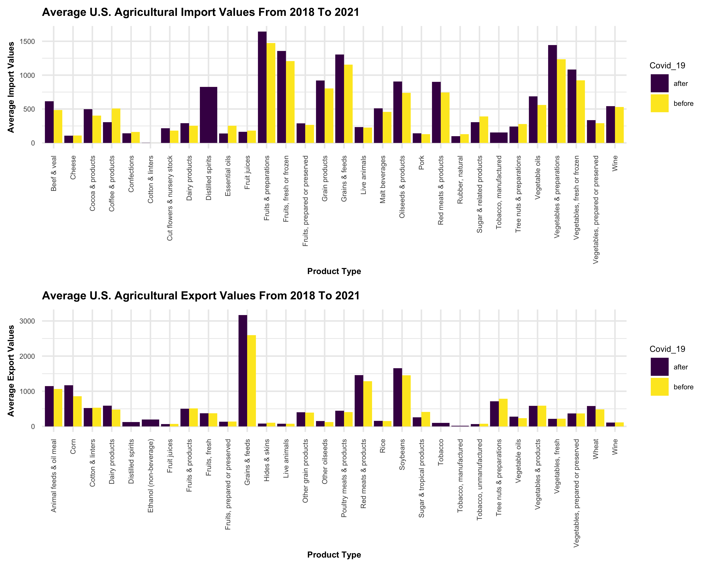
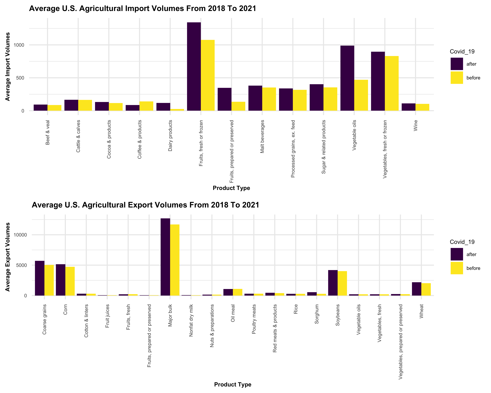

two\_panel\_bar\_charts
================
AnMei Chen
12/4/2021

``` r
library(tidyverse)
```

    ## ── Attaching packages ─────────────────────────────────────── tidyverse 1.3.1 ──

    ## ✓ ggplot2 3.3.5     ✓ purrr   0.3.4
    ## ✓ tibble  3.1.5     ✓ dplyr   1.0.7
    ## ✓ tidyr   1.1.3     ✓ stringr 1.4.0
    ## ✓ readr   2.0.1     ✓ forcats 0.5.1

    ## ── Conflicts ────────────────────────────────────────── tidyverse_conflicts() ──
    ## x dplyr::filter() masks stats::filter()
    ## x dplyr::lag()    masks stats::lag()

``` r
library(ggpubr)

knitr::opts_chunk$set(
  fig.width = 7,
  fig.asp = .8,
  out.width = "110%",
  dpi = 600
)

theme_set(theme_minimal())

options(
  ggplot2.continuous.colour = "viridis",
  ggplot2.continuous.fill = "viridis"
)

scale_colour_discrete = scale_colour_viridis_d
scale_fill_discrete = scale_fill_viridis_d
```

load 2018 to 2021 import and export value and volume dataframe

``` r
import_value_df = 
  read_csv("data/cleaned data/import_value_combined.csv")
```

    ## Rows: 1241 Columns: 4

    ## ── Column specification ────────────────────────────────────────────────────────
    ## Delimiter: ","
    ## chr (2): product_type, month
    ## dbl (2): year, import_value

    ## 
    ## ℹ Use `spec()` to retrieve the full column specification for this data.
    ## ℹ Specify the column types or set `show_col_types = FALSE` to quiet this message.

``` r
export_value_df = 
  read_csv("data/cleaned data/export_value_combined.csv")
```

    ## Rows: 1180 Columns: 4

    ## ── Column specification ────────────────────────────────────────────────────────
    ## Delimiter: ","
    ## chr (2): product_type, month
    ## dbl (2): year, export_value

    ## 
    ## ℹ Use `spec()` to retrieve the full column specification for this data.
    ## ℹ Specify the column types or set `show_col_types = FALSE` to quiet this message.

``` r
import_volume_df = 
  read_csv("data/cleaned data/import_volume_combined.csv")
```

    ## Rows: 585 Columns: 4

    ## ── Column specification ────────────────────────────────────────────────────────
    ## Delimiter: ","
    ## chr (2): product_type, month
    ## dbl (2): year, import_volume

    ## 
    ## ℹ Use `spec()` to retrieve the full column specification for this data.
    ## ℹ Specify the column types or set `show_col_types = FALSE` to quiet this message.

``` r
export_volume_df = 
  read_csv("data/cleaned data/export_volume_combined.csv")
```

    ## Rows: 855 Columns: 4

    ## ── Column specification ────────────────────────────────────────────────────────
    ## Delimiter: ","
    ## chr (2): product_type, month
    ## dbl (2): year, export_volume

    ## 
    ## ℹ Use `spec()` to retrieve the full column specification for this data.
    ## ℹ Specify the column types or set `show_col_types = FALSE` to quiet this message.

## two-panel (export value/import value) bar chart

Calculate the average export/import value of each product type for
2018-2019 (Before Covid-19) and 2020-2021 (After Covid-19).

``` r
before_covid_import_value =
  import_value_df %>% 
  filter(year == "2018" | year == "2019") %>% 
  add_column("Covid_19" = "before") %>% 
  group_by(product_type, Covid_19) %>% 
  summarize(average = mean(import_value)) 
```

    ## `summarise()` has grouped output by 'product_type'. You can override using the `.groups` argument.

``` r
after_covid_import_value =
  import_value_df %>% 
  filter(year == "2020" | year == "2021") %>% 
  add_column("Covid_19" = "after") %>% 
  group_by(product_type, Covid_19) %>% 
  summarize(average = mean(import_value)) 
```

    ## `summarise()` has grouped output by 'product_type'. You can override using the `.groups` argument.

``` r
covid_import_value_df = 
  rbind(before_covid_import_value,after_covid_import_value)

before_covid_export_value =
  export_value_df %>% 
  filter(year == "2018" | year == "2019") %>% 
  add_column("Covid_19" = "before") %>% 
  group_by(product_type, Covid_19) %>% 
  summarize(average = mean(export_value))
```

    ## `summarise()` has grouped output by 'product_type'. You can override using the `.groups` argument.

``` r
after_covid_export_value =
  export_value_df %>% 
  filter(year == "2020" | year == "2021") %>% 
  add_column("Covid_19" = "after") %>% 
  group_by(product_type, Covid_19) %>% 
  summarize(average = mean(export_value)) 
```

    ## `summarise()` has grouped output by 'product_type'. You can override using the `.groups` argument.

``` r
covid_export_value_df = 
  rbind(before_covid_export_value,after_covid_export_value)
```

Generate a two-panel (export value/import value) bar chart with product
type as x-axis, average export/import value as y-axis, and colored by
before/after Covid-19.

``` r
covid_import_value_plot =  
  covid_import_value_df %>%
  ggplot(aes(x = product_type, y = average, fill = Covid_19)) +
  geom_bar(stat = "identity", position = "dodge") +
  labs(
    title = "Average U.S. Agricultural Import Values From 2018 To 2021 ",
    x = "Product Type",
    y = "Average Import Values",
  ) +
  theme(
    axis.text.x = element_text(angle = 90, vjust = 0.5, hjust = 1, size = 5),
    axis.text.y = element_text(size = 5),
    axis.title = element_text(size = 6, face = "bold"),
    legend.key.size = unit(0.5,"cm"),
    legend.text = element_text(size = 5),
    legend.title = element_text(size = 6),
    plot.title = element_text(size = 8,face = "bold")
    ) 

covid_export_value_plot =  
  covid_export_value_df %>%
  ggplot(aes(x = product_type, y = average, fill = Covid_19)) +
  geom_bar(stat = "identity", position = "dodge") +
  labs(
    title = "Average U.S. Agricultural Export Values From 2018 To 2021 ",
    x = "Product Type",
    y = "Average Export Values",
  ) +
  theme(
    axis.text.x = element_text(angle = 90, vjust = 0.5, hjust = 1, size = 5),
    axis.text.y = element_text(size = 5),
    axis.title = element_text(size = 6, face = "bold"),
    legend.key.size = unit(0.5,"cm"),
    legend.text = element_text(size = 5),
    legend.title = element_text(size = 6),
    plot.title = element_text(size = 8, face = "bold")
    )


ggarrange(covid_import_value_plot, covid_export_value_plot, ncol = 1)
```



## two-panel (export volume/import volume ) bar chart

Calculate the average export/import value of each product type for
2018-2019 (Before Covid-19) and 2020-2021 (After Covid-19).

``` r
before_covid_import_volume =
  import_volume_df %>%
  filter(year == "2018" | year == "2019") %>% 
  add_column("Covid_19" = "before") %>% 
  group_by(product_type, Covid_19) %>% 
  summarize(average = mean(import_volume))
```

    ## `summarise()` has grouped output by 'product_type'. You can override using the `.groups` argument.

``` r
after_covid_import_volume =
  import_volume_df %>% 
  filter(year == "2020" | year == "2021") %>% 
  add_column("Covid_19" = "after") %>% 
  group_by(product_type, Covid_19) %>% 
  summarize(average = mean(import_volume))
```

    ## `summarise()` has grouped output by 'product_type'. You can override using the `.groups` argument.

``` r
covid_import_volume_df = 
  rbind(before_covid_import_volume,after_covid_import_volume)

before_covid_export_volume =
  export_volume_df %>%
  filter(year == "2018" | year == "2019") %>% 
  add_column("Covid_19" = "before") %>% 
  group_by(product_type, Covid_19) %>% 
  summarize(average = mean(export_volume)) 
```

    ## `summarise()` has grouped output by 'product_type'. You can override using the `.groups` argument.

``` r
after_covid_export_volume =
  export_volume_df %>% 
  filter(year == "2020" | year == "2021") %>% 
  add_column("Covid_19" = "after") %>% 
  group_by(product_type, Covid_19) %>% 
  summarize(average = mean(export_volume)) 
```

    ## `summarise()` has grouped output by 'product_type'. You can override using the `.groups` argument.

``` r
covid_export_volume_df = 
  rbind(before_covid_export_volume,after_covid_export_volume)
```

Generate a two-panel (export volume/import volume ) bar chart with
product type as x-axis, average export/import volume as y-axis, and
colored by before/after Covid-19.

``` r
covid_import_volume_plot =  
  covid_import_volume_df %>%
  ggplot(aes(x = product_type, y = average, fill = Covid_19)) +
  geom_bar(stat = "identity", position = "dodge") +
  labs(
    title = "Average U.S. Agricultural Import Volumes From 2018 To 2021 ",
    x = "Product Type",
    y = "Average Import Volumes",
  ) +
  theme(
    axis.text.x = element_text(angle = 90, vjust = 0.5, hjust = 1, size = 5),
    axis.text.y = element_text(size = 5),
    axis.title = element_text(size = 6, face = "bold"),
    legend.key.size = unit(0.5,"cm"),
    legend.text = element_text(size = 5),
    legend.title = element_text(size = 6),
    plot.title = element_text(size = 8,face = "bold")
    ) 


covid_export_volume_plot =  
  covid_export_volume_df %>%
  ggplot(aes(x = product_type, y = average, fill = Covid_19)) +
  geom_bar(stat = "identity", position = "dodge") +
  labs(
    title = "Average U.S. Agricultural Export Volumes From 2018 To 2021 ",
    x = "Product Type",
    y = "Average Export Volumes",
  ) +
  theme(
    axis.text.x = element_text(angle = 90, vjust = 0.5, hjust = 1, size = 5),
    axis.text.y = element_text(size = 5),
    axis.title = element_text(size = 6, face = "bold"),
    legend.key.size = unit(0.5,"cm"),
    legend.text = element_text(size = 5),
    legend.title = element_text(size = 6),
    plot.title = element_text(size = 8, face = "bold")
    )


ggarrange(covid_import_volume_plot, covid_export_volume_plot, ncol = 1)
```


